### 项目名称

电商后台管理系统

### 项目描述

该项目主要运用了Vue2.0结合Element UI开发的后台管理系统

### 项目预览

[项目在线预览](http://47.97.37.90/dv_shop)

### 项目描述

# 登录页面
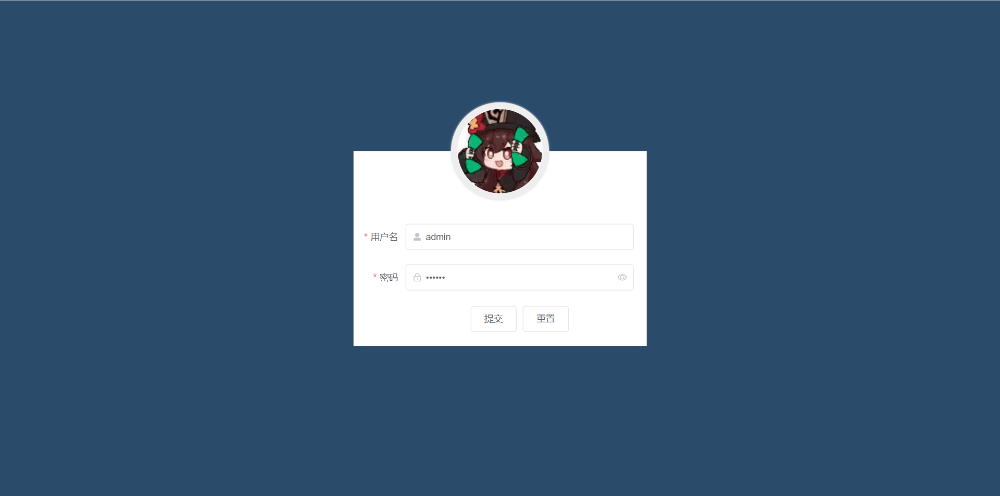
# welcome页面
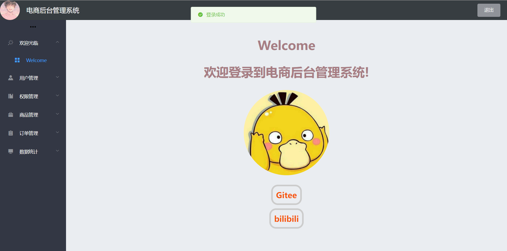
# 用户列表页面
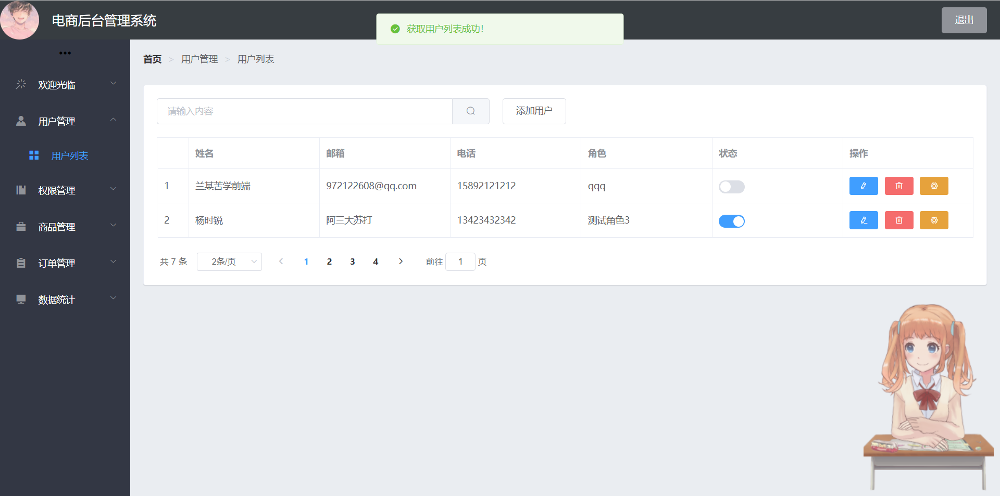
# 权限管理页面
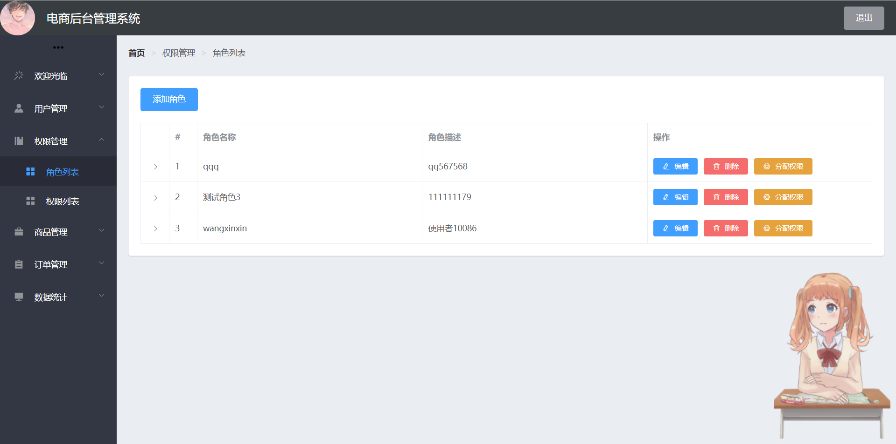
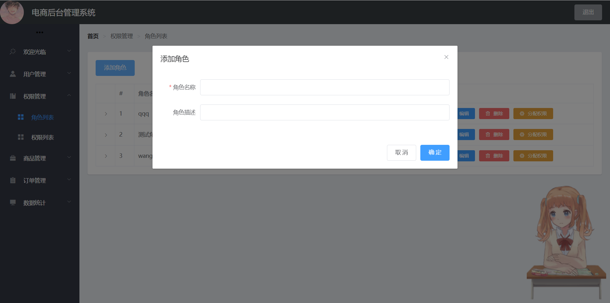
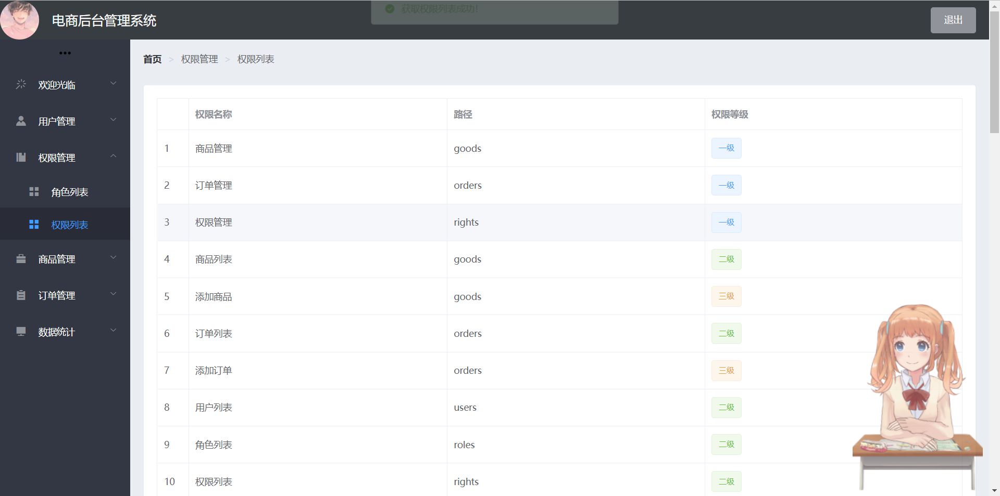
# 商品管理页面
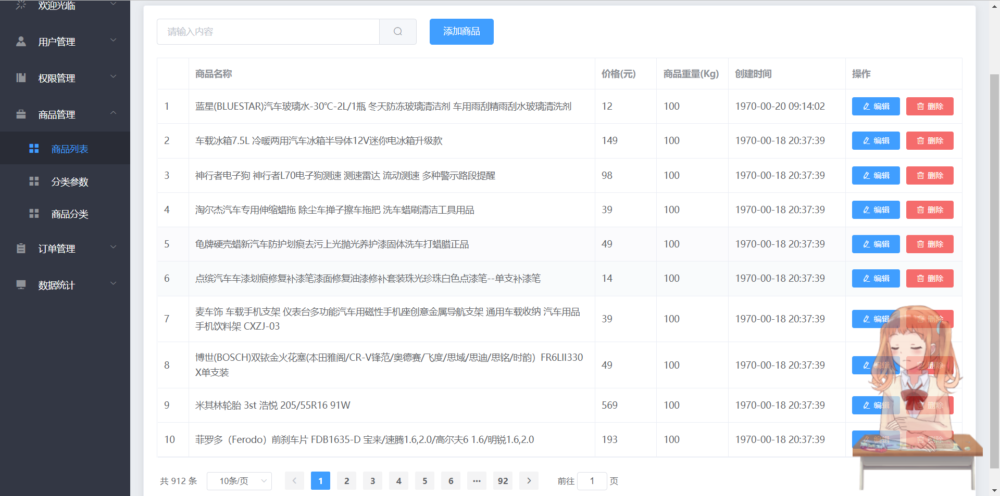
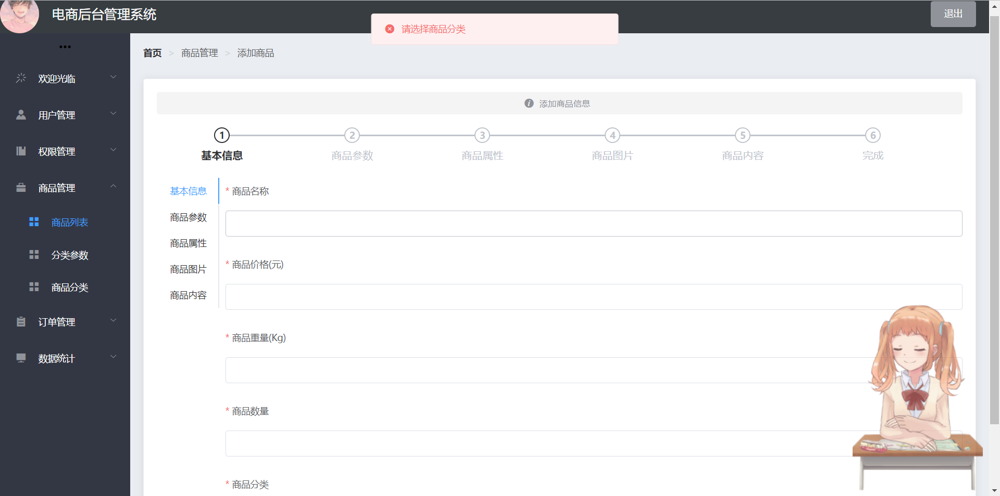
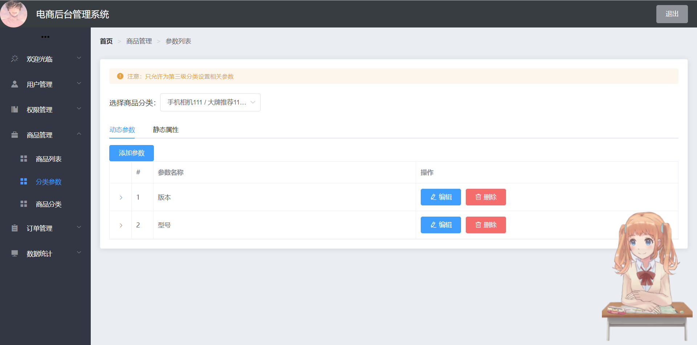
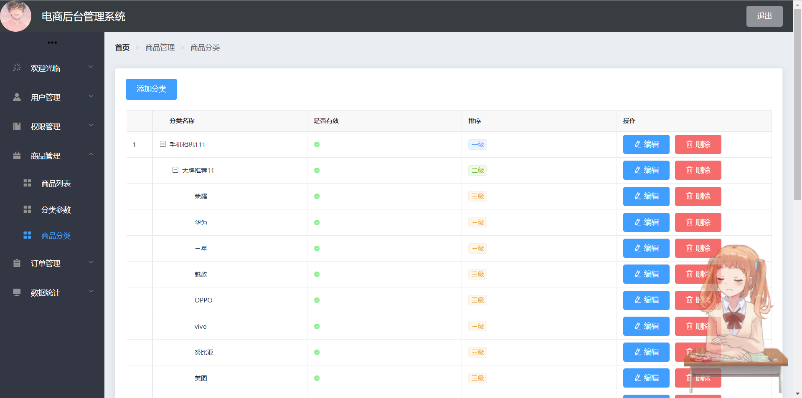
# 订单管理页面
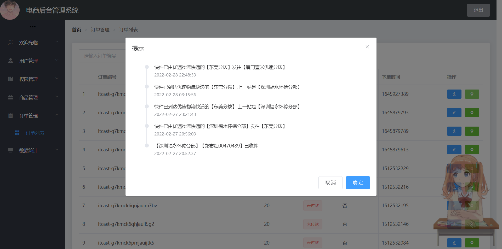
# 数据统计页面
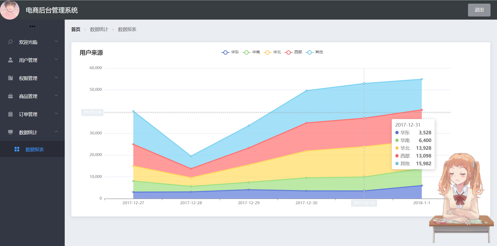